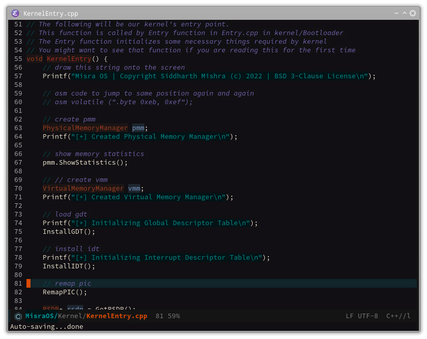

# emacs.d
#### My Custom Emacs Configuration

The average init time now is about 0.91-9.95 seconds. This can be reduced significantly by
using emacs daemon and client (best is 0.25 seconds and worst is 0.36 seconds)
I have two keyboard shortcuts :
- **M**-**S**-**e** : `emacs --daemon`
- **M**-**e** : `emacsclient -cnqu -a emacs`

Below is a series of screenshots on how it improves through time
